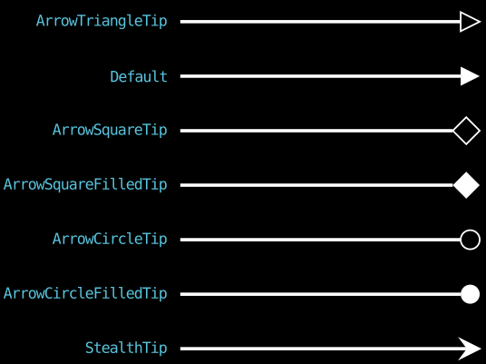
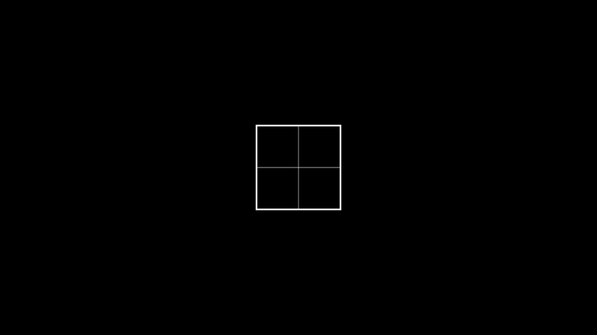

# 二、基本几何图形

下面介绍的是一些比较常用的几何图形。
这是[参考来源](https://docs.manim.community/en/v0.19.2/reference/manim.mobject.geometry.html)。部分不常用的图形没有收录到本文中。


- [二、基本几何图形](#二基本几何图形)
  - [2.1 点](#21-点)
      - [Dot 点](#dot-点)
      - [LabeledDot 带标签的点](#labeleddot-带标签的点)
  - [2.2 线](#22-线)
      - [Line 线](#line-线)
      - [DashedLine 虚线](#dashedline-虚线)
      - [TangentLine 切线](#tangentline-切线)
      - [Arc 弧](#arc-弧)
      - [ArcBetweenPoints 两点间的弧](#arcbetweenpoints-两点间的弧)
  - [2.3 角](#23-角)
      - [Angle 角](#angle-角)
      - [RightAngle 直角](#rightangle-直角)
  - [2.4 箭头](#24-箭头)
      - [Arrow 箭头](#arrow-箭头)
      - [DoubleArrow 双向箭头](#doublearrow-双向箭头)
      - [CurvedArrow 弯曲的箭头](#curvedarrow-弯曲的箭头)
      - [CurvedDoubleArrow 弯曲的双向箭头](#curveddoublearrow-弯曲的双向箭头)
      - [Vector 向量](#vector-向量)
  - [2.5 圆滑的图形](#25-圆滑的图形)
      - [Circle 圆](#circle-圆)
      - [Ellipse 椭圆](#ellipse-椭圆)
      - [Annulus 圆环](#annulus-圆环)
      - [AnnularSector 扇环](#annularsector-扇环)
      - [Sector 扇形](#sector-扇形)
  - [2.6 板正的图形](#26-板正的图形)
      - [Polygon 多边形](#polygon-多边形)
      - [Triangle 等边三角形](#triangle-等边三角形)
      - [Rectangle 矩形](#rectangle-矩形)
      - [RoundedRectangle 圆角矩形](#roundedrectangle-圆角矩形)
      - [Square 正方形](#square-正方形)
      - [RegularPolygon 正多边形](#regularpolygon-正多边形)
      - [RegularPolygram 正星形多边形](#regularpolygram-正星形多边形)
      - [Star 星星](#star-星星)
  - [2.7 附庸（形状匹配器）](#27-附庸形状匹配器)
      - [SurroundingRectangle 围绕矩形](#surroundingrectangle-围绕矩形)
      - [BackgroundRectangle 背景矩形](#backgroundrectangle-背景矩形)
      - [Cross 叉](#cross-叉)
      - [Underline 下划线](#underline-下划线)
  - [2.8 图形的布尔运算](#28-图形的布尔运算)
      - [二元运算](#二元运算)
      - [Cutout 剪下](#cutout-剪下)
  - [2.9 未介绍的](#29-未介绍的)


## 2.1 点
#### Dot 点
[Dot() 文档](https://docs.manim.community/en/v0.19.2/reference/manim.mobject.geometry.arc.Dot.html)
- 位置：`point=array([0., 0., 0.])`
- 半径：`radius=0.08`

本质是实心[圆](#circle-圆)。

#### LabeledDot 带标签的点
[LabeledDot() 文档](https://docs.manim.community/en/v0.19.2/reference/manim.mobject.geometry.arc.LabeledDot.html)
- 标签：`label` (*str | SingleStringMathTex | Text | Tex*)
- 半径：`radius=None`
- 缓冲：`buff=0.1`

若以 *str* 类型给定标签，则文本会渲染成 *MathTex* 格式。
若给定半径，则忽略缓冲。


## 2.2 线
#### Line 线
[Line() 文档](https://docs.manim.community/en/v0.19.2/reference/manim.mobject.geometry.line.Line.html)
- 起点：`start=array([-1., 0., 0.])`
- 终点：`end=array([1., 0., 0.])`
- 缓冲：`buff=0`
- 圆心角：`path_arc=0`  若该值不为0，则线会弯曲，详见Arc

方法很多，比如说获取倾斜角(`get_angle()`)，获得点在该线上的投影(`get_projection(point)`)，获得斜率(`get_slope()`)，获得单位向量(`get_unit_vector()`)，获得向量(`get_vector()`)等等。

#### DashedLine 虚线
[DashedLine() 文档](https://docs.manim.community/en/v0.19.2/reference/manim.mobject.geometry.line.DashedLine.html)
- 短划线长度：`dash_length=0.05`
- 划线与空格之比：`dashed_ratio=0.5`  取值0~1

这是[Line](#line-线)的子类。这意味着，Line的部分参数和方法，在DashedLine也适用。因此，弯曲虚线和虚线箭头都是可以创建出来的。

#### TangentLine 切线
[TangentLine() 文档](https://docs.manim.community/en/v0.19.2/reference/manim.mobject.geometry.line.TangentLine.html)
- 矢量数学对象：`vmob`
- 切点在vmob的位置：`alpha`  取值0~1
- 长度：`length=1`

这也是[Line](#line-线)的子类。

#### Arc 弧
[Arc() 文档](https://docs.manim.community/en/v0.19.2/reference/manim.mobject.geometry.arc.Arc.html)
- 半径：`radius=1.0`
- 起始角度：`start_angle=0`
- 弧所对圆心角：`angle=PI/2`  逆时针，默认值为π/2

找圆心用`get_arc_center()`，找背景矩形的中心用`get_center()`，找弧线的中点用`get_midpoint()`，找弧线的n等分点用`point_from_proportion(1/n)`。

#### ArcBetweenPoints 两点间的弧
[ArcBetweenPoints() 文档](https://docs.manim.community/en/v0.19.2/reference/manim.mobject.geometry.arc.ArcBetweenPoints.html)
- 起点：`start`
- 终点：`end`
- 圆心角：`angle=PI/2`
- 半径：`radius=None`

[Arc](#arc-弧)的子类。
若给定半径，则忽略圆心角。半径的正负号决定方向，半径的绝对值必须大于等于两点距离的一半，且给定半径画不了优弧。


## 2.3 角
#### Angle 角
[Angle() 文档](https://docs.manim.community/en/v0.19.2/reference/manim.mobject.geometry.line.Angle.html)
- 两线：`line1` `line2` (*Line*)
- 半径：`radius=None` *(float*)
- 象限：`quadrant=(1, 1)`  取值为(1,1), (-1,1), (1,-1), (-1,-1)
- 切换优劣：`other_angle=False`  从line1逆时针(False)或顺时针(True)到line2

`Angle.from_three_points(A, B, C)`可构造$\angle ABC$。（逆时针）
`get_lines()`可获取成角的两线。（返回VGroup）
`get_value(degrees=False)`可获取角度值。

#### RightAngle 直角
[RightAngle() 文档](https://docs.manim.community/en/v0.19.2/reference/manim.mobject.geometry.line.RightAngle.html)
- 两线：`line1` `line2` (*Line*)
- 长度：`length=None` *(float*)

[Angle](#angle-角)的子类。即使两线不垂直，也是能画出直角符号的，只是有点丑。


## 2.4 箭头
由于[Line](#line-线)是[TipableVMobject](https://docs.manim.community/en/v0.19.2/reference/manim.mobject.geometry.arc.TipableVMobject.html)的子类，所以Line及其子类可用`add_tip()`来添加箭头的尖端。

#### Arrow 箭头
[Arrow() 文档](https://docs.manim.community/en/v0.19.2/reference/manim.mobject.geometry.line.Arrow.html)
[Line](#line-线)的子类，只是终点(end)处有个尖端(tip)。不过尖端的样式有很多，使用参数`tip_shape`更改。


#### DoubleArrow 双向箭头
[DoubleArrow() 文档](https://docs.manim.community/en/v0.19.2/reference/manim.mobject.geometry.line.DoubleArrow.html)
[Arrow](#arrow-箭头)的子类。

#### CurvedArrow 弯曲的箭头
[CurvedArrow() 文档](https://docs.manim.community/en/v0.19.2/reference/manim.mobject.geometry.arc.CurvedArrow.html)
[ArcBetweenPoints](#arcbetweenpoints-两点间的弧)的子类，只是多了个尖端。

#### CurvedDoubleArrow 弯曲的双向箭头
[CurvedDoubleArrow() 文档](https://docs.manim.community/en/v0.19.2/reference/manim.mobject.geometry.arc.CurvedDoubleArrow.html)
[CurvedArrow](#curvedarrow-弯曲的箭头)的子类。

#### Vector 向量
[Vector() 文档](https://docs.manim.community/en/v0.19.2/reference/manim.mobject.geometry.line.Vector.html)
- 方向：`direction=array([1., 0., 0.])`
- 缓冲：`buff=0`

[Arrow](#arrow-箭头)的子类，起点变成原点(`ORIGIN`)，本质就是一个箭头。
有一个专属方法`coordinate_label`（坐标标签），但这里不会详细介绍。


## 2.5 圆滑的图形
#### Circle 圆
[Circle() 文档](https://docs.manim.community/en/v0.19.2/reference/manim.mobject.geometry.arc.Circle.html)
- 半径：`radius=None`
- 颜色：`color=RED`

[Arc](#arc-弧)的子类。
`Circle.from_three_points(p1, p2, p3)`三点决定圆。
`point_at_angle(angle)`根据角度决定圆上一点的坐标。
`surround(mobject, dim_to_match=0, stretch=False, buffer_factor=1.2)`返回一个环绕指定数学对象~(的背景矩形)~的圆。buffer_factor小于1则在内，大于1则在外。

#### Ellipse 椭圆
[Ellipse() 文档](https://docs.manim.community/en/v0.19.2/reference/manim.mobject.geometry.arc.Ellipse.html)
- 宽：`width=2`
- 高：`height=1`

[Circle](#circle-圆)的子类。

#### Annulus 圆环
[Annulus() 文档](https://docs.manim.community/en/v0.19.2/reference/manim.mobject.geometry.arc.Annulus.html)
- 内圈半径：`inner_radius=1`
- 外圈半径：`outer_radius=2`

[Circle](#circle-圆)的子类。

#### AnnularSector 扇环
[AnnularSector() 文档](https://docs.manim.community/en/v0.19.2/reference/manim.mobject.geometry.arc.AnnularSector.html)
- 内圈半径：`inner_radius=1`
- 外圈半径：`outer_radius=2`
- 圆心角：`angle=PI/2`
- 起始角度：`start_angle=0`

[Arc](#arc-弧)的子类。

#### Sector 扇形
[Sector() 文档](https://docs.manim.community/en/v0.19.2/reference/manim.mobject.geometry.arc.Sector.html)
- 半径：`radius=1`

[AnnularSector](#annularsector-扇环)的子类。可参考AnnularSector来设置圆心角`angle`和起始角度`start_angle`。


## 2.6 板正的图形
#### Polygon 多边形
[Polygon() 文档](https://docs.manim.community/en/v0.19.2/reference/manim.mobject.geometry.polygram.Polygon.html)
- 顶点：`*vertices`

[Polygram](https://docs.manim.community/en/v0.19.2/reference/manim.mobject.geometry.polygram.Polygram.html)（一种广义的多边形，允许存在不相连的边集）的子类。
因为本文不介绍Polygram，所以在这里列一下Polygram的方法。
`get_vertex_groups()`返回分好组的顶点列表（三维数组）。
`get_vertices()`返回不分组的顶点列表（二维数组）。
`round_corners(radius = 0.5)`让图形有圆角，该方法的其他参数暂不介绍。
```Python
>>> from manim import *
>>> poly = Polygram([ORIGIN, RIGHT, UP, LEFT + UP], [LEFT, LEFT + UP, 2 * LEFT])
>>> groups = poly.get_vertex_groups()  # 返回分好组的顶点列表
>>> len(groups)
2
>>> groups[0]
array([[ 0.,  0.,  0.],
       [ 1.,  0.,  0.],
       [ 0.,  1.,  0.],
       [-1.,  1.,  0.]])
>>> groups[1]
array([[-1.,  0.,  0.],
       [-1.,  1.,  0.],
       [-2.,  0.,  0.]])
>>> poly.get_vertices()  # 返回不分组的顶点列表
array([[ 0.,  0.,  0.],
       [ 1.,  0.,  0.],
       [ 0.,  1.,  0.],
       [-1.,  1.,  0.],
       [-1.,  0.,  0.],
       [-1.,  1.,  0.],
       [-2.,  0.,  0.]])
```

#### Triangle 等边三角形
[Triangle() 文档](https://docs.manim.community/en/v0.19.2/reference/manim.mobject.geometry.polygram.Triangle.html)
[RegularPolygon](#regularpolygon-正多边形)（正多边形）的子类。

#### Rectangle 矩形
[Rectangle() 文档](https://docs.manim.community/en/v0.19.2/reference/manim.mobject.geometry.polygram.Rectangle.html)
- 颜色：`color=WHITE`
- 高：`height=2.0`
- 宽：`width=4.0`
- 竖直网格线的间距：`grid_xstep=None`
- 水平网格线的间距：`grid_ystep=None`

[Polygon](#polygon-多边形)的子类。
可以为内部网格线单独设置属性。
```Python
rect = Rectangle(width=2.0, height=2.0, grid_xstep=1.0, grid_ystep=1.0)
rect.grid_lines.set_stroke(width=1)
self.add(rect)
```


#### RoundedRectangle 圆角矩形
[RoundedRectangle() 文档](https://docs.manim.community/en/v0.19.2/reference/manim.mobject.geometry.polygram.RoundedRectangle.html)
- 圆角半径：`corner_radius=0.5`

[Rectangle](#rectangle-矩形)的子类。

#### Square 正方形
[Square() 文档](https://docs.manim.community/en/v0.19.2/reference/manim.mobject.geometry.polygram.Square.html)
- 边长：`side_length=2.0`

[Rectangle](#rectangle-矩形)的子类。

#### RegularPolygon 正多边形
[RegularPolygon() 文档](https://docs.manim.community/en/v0.19.2/reference/manim.mobject.geometry.polygram.RegularPolygon.html)
- 边数：`n=6`

[RegularPolygram](#regularpolygram-正星形多边形)的子类。

#### RegularPolygram 正星形多边形
[RegularPolygram() 文档](https://docs.manim.community/en/v0.19.2/reference/manim.mobject.geometry.polygram.RegularPolygram.html)
- 顶点数：`num_vertices`
- 密度：`density=2`  每个点与周围第`density`个点相连
- 半径：`radius=1`
- 起始角度：`start_angle=None`

[Polygram](https://docs.manim.community/en/v0.19.2/reference/manim.mobject.geometry.polygram.Polygram.html)的子类。
下图是顶点数为7时，不同密度的情况。


#### Star 星星
[Star() 文档](https://docs.manim.community/en/v0.19.2/reference/manim.mobject.geometry.polygram.Star.html)
- 外部顶点数：`n=5`
- 外部顶点所在圆半径：`outer_radius=1`
- 内部顶点所在圆半径：`inner_radius=None`
- 密度：`density=2`  若指定`inner_radius`，则忽略`density`
- 起始角度：`start_angle=PI/2`

[Polygon](#polygon-多边形)的子类。这算是没有内部连线的[RegularPolygram](#regularpolygram-正星形多边形)。


## 2.7 附庸（形状匹配器）
#### SurroundingRectangle 围绕矩形
[SurroundingRectangle() 文档](https://docs.manim.community/en/v0.19.2/reference/manim.mobject.geometry.shape_matchers.SurroundingRectangle.html)
- 被围绕的对象：`*mobjects`
- 颜色：`color=YELLOW`
- 缓冲：`buff=0.1`
- 圆角半径：`corner_radius=0.0`

[RoundedRectangle](#roundedrectangle-圆角矩形)的子类。

#### BackgroundRectangle 背景矩形
[BackgroundRectangle() 文档](https://docs.manim.community/en/v0.19.2/reference/manim.mobject.geometry.shape_matchers.BackgroundRectangle.html)
- 被围绕的对象：`*mobjects`
- 颜色：`color=None`  默认颜色为场景的背景色
- 线宽：`stroke_width=0`
- 线条不透明度：`stroke_opacity=0`  默认不显示描边线条
- 填充不透明度：`fill_opacity=0.75`
- 缓冲：`buff=0`  默认贴合对象

[SurroundingRectangle](#surroundingrectangle-围绕矩形)的子类。

#### Cross 叉
[Cross() 文档](https://docs.manim.community/en/v0.19.2/reference/manim.mobject.geometry.shape_matchers.Cross.html)
- 数学对象：`mobject=None`
- 线条颜色：`stroke_color=RED`
- 线宽：`stroke_width=6.0`
- 缩放系数：`scale_factor=1.0`

本质是包括了两条线的[VGroup](https://docs.manim.community/en/v0.19.2/reference/manim.mobject.types.vectorized_mobject.VGroup.html)（矢量组合）。

#### Underline 下划线
[Underline() 文档](https://docs.manim.community/en/v0.19.2/reference/manim.mobject.geometry.shape_matchers.Underline.html)
- 数学对象：`mobject`
- 缓冲：`buff=0.1`

[Line](#line-线)的子类。


## 2.8 图形的布尔运算
#### 二元运算
交集 `Intersection(*vmobjects, **kwargs)`
并集 `Union(*vmobjects, **kwargs)`
对称差 `(subject, clip, **kwargs)`
差集 `Difference(subject, clip, **kwargs)` 参数是前者减后者
更多内容可参考[boolean_ops](https://docs.manim.community/en/v0.19.2/reference/manim.mobject.geometry.boolean_ops.html)和[示例图库](https://docs.manim.community/en/v0.19.2/examples.html#booleanoperations)。


#### Cutout 剪下
[Cutout() 文档](https://docs.manim.community/en/v0.19.2/reference/manim.mobject.geometry.polygram.Cutout.html)
- 被减图案：`main_shape`
- 减去图案：`*mobjects`

类似于对称差，区别在于，这个是一对多。


## 2.9 未介绍的
AnnotationDot 注释点
ArcPolygon 弧多边形
ArcPolygonFromArcs 从弧线创建的弧多边形
CubicBezier 三次贝赛尔曲线
TangentialArc 与两线相切的弧

Label 标签
LabeledArrow 带标签的箭头
LabeledLine 带标签的线
LabeledPolygram 带标签的多边形

Elbow 直角标志

ConvexHull 凸包
Polygram 多边形组合
……


