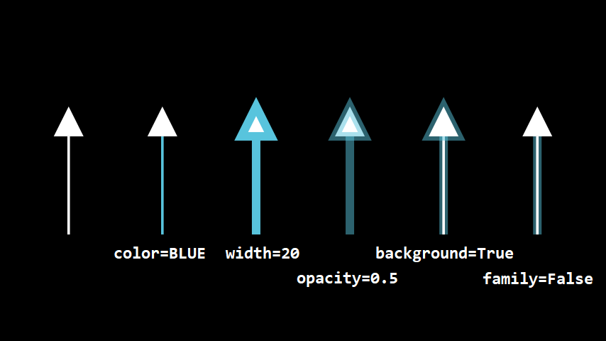
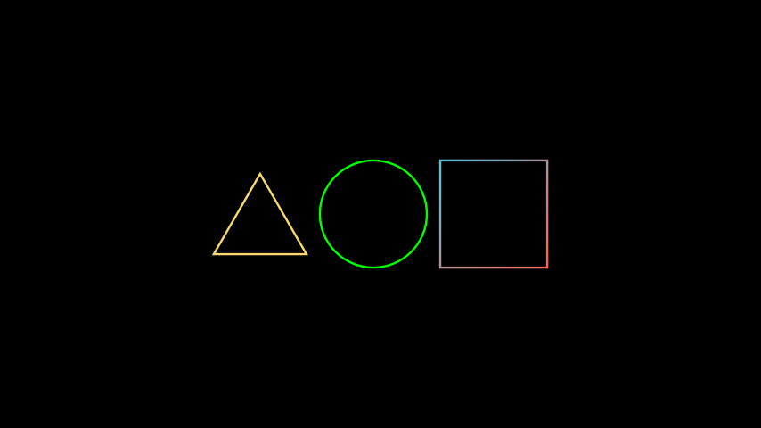
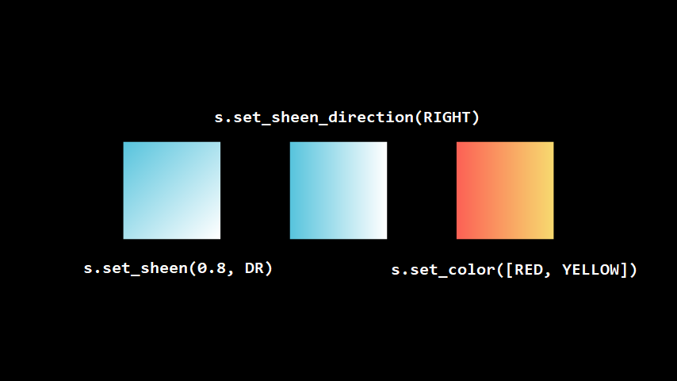
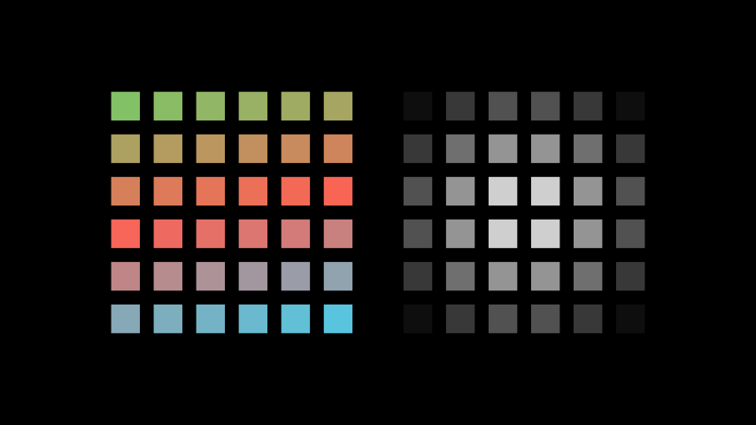

# 三、图形样貌

- [三、图形样貌](#三图形样貌)
  - [3.1 线条](#31-线条)
  - [3.2 填充](#32-填充)
  - [3.3 颜色](#33-颜色)

若有多个图形使用相同的样式，那不妨试试**字典解包**。
```Python
CONFIG = {
    "stroke_width": 5,
    "stroke_color": WHITE,
    "stroke_opacity": 1,
    "fill_opacity": 1,
    "fill_color": color_gradient([PURE_RED, YELLOW], 2),
}

# 使用2个 * 进行字典解包
rec = Rectangle(**CONFIG)
cir = Circle(1, **CONFIG)
tri = Triangle(**CONFIG)
squ = Square(**CONFIG)

self.add(Group(rec, cir, tri, squ).arrange())
```


## 3.1 线条
可使用`set_stroke()`方法来设置线条样式。
- 颜色：`color`
- 线宽：`width`
- 不透明度：`opacity` 0~1，1表示完全不透明，0表示完全透明
- 是否设置背景线条：`background=False`
- 子对象是否也这样设置：`family=True`



此处以`Arrow()`为例，其中的*箭头尖端*就是箭头的子对象。（也不知为啥，设置了`width`之后，尖端才有描边。）

设置背景线条，也可以使用`set_background_stroke()`。


## 3.2 填充
可使用`set_fill()`方法来设置填充样式。
- 颜色：`color`
- 不透明度：`opacity`
- 子对象是否也这样设置：`family=True`


## 3.3 颜色
以下部分内容 ~~抄袭~~ 借鉴了[〔manim教程〕第三讲 颜色的表示、运算与设置](https://www.bilibili.com/video/BV1vZ4y1x7hT)和[鹤翔万里的文章](https://blog.tonycrane.cc/p/2e2c9a7.html)，在此膜拜大佬。

可以在设置参数时传入颜色，也可以使用`set_color(color)`来设置颜色。可以使用内置的颜色常量，也可以使用颜色字符串。（建议使用VSCode中的插件Color Highlight）
```Python
tri = Triangle(color=YELLOW)  # 使用参数设置
cir = Circle(1).set_color('#00ff00')  # 使用十六进制颜色码
squ = Square().set_color([RED, BLUE])  # 使用颜色常量，且渐变
```


使用`set_color`之类的方法，是对数学对象进行**更改**，并**返回**更改后的数学对象。因此，以下两段代码实现的功能是等价的。（manim大部分方法都支持这种效果）
```Python
cir = Circle(1)
cir.set_color('#00ff00')
```
```Python
cir = Circle(1).set_color('#00ff00')
```

关于颜色，manim提供了一些运算函数。
* `invert_color(color)` 返回指定颜色的反色。
* `interpolate_color(color1, color2, alpha)` 在两颜色间用alpha比例插值。
* `average_color(*colors)` 返回平均颜色。
* `color_gradient(reference_color:颜色数组, length_of_output:int)` 传入参考颜色，返回渐变颜色列表。
* `random_color()` 返回随机颜色。
* `random_bright_color()` 返回随机亮色（随机颜色与白色的均值）。

对于设置单个对象的渐变色，可以使用以下方法。
* `set_sheen(factor, direction, family=True)`给对象增加光泽。
`factor`设置光泽的尺度（浮点数），可看做是原本颜色向白色的渐变。若传入负的浮点数，则是原本颜色向黑色的渐变。
`direction`设置光泽变化的方向，也就是颜色渐变的方向。
* `set_sheen_direction(direction, family=True)`则是只设置渐变的方向。



对于设置Group或VGroup的子对象的颜色，以达到渐变的效果，那么可以使用以下方法。
* `set_color_by_gradient(*colors)` 从头到尾设置渐变颜色。
* `set_colors_by_radial_gradient(center, radius, inner_color, outer_color)` 根据距离半径设置渐变颜色。（径向渐变）

```Python
vg = VGroup()
for i in range(36):
    vg.add(Square(0.5).set_color(BLUE).set_fill(opacity=1))
vg.arrange_in_grid(rows=6, cols=6, buff=0.3)

vg.set_color_by_gradient(GREEN, RED, BLUE)  # 从头到尾渐变
vg1 = vg.copy().set_colors_by_radial_gradient(radius=3)  # 径向渐变

self.add(VGroup(vg, vg1).arrange(buff=1))
```
