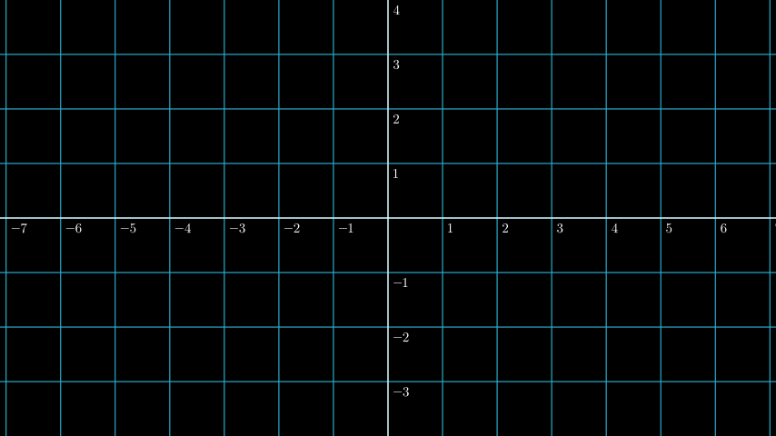
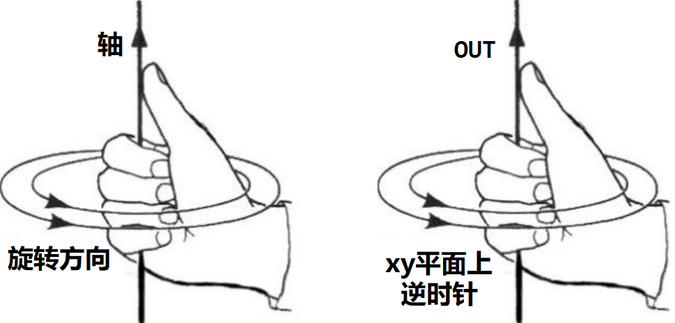
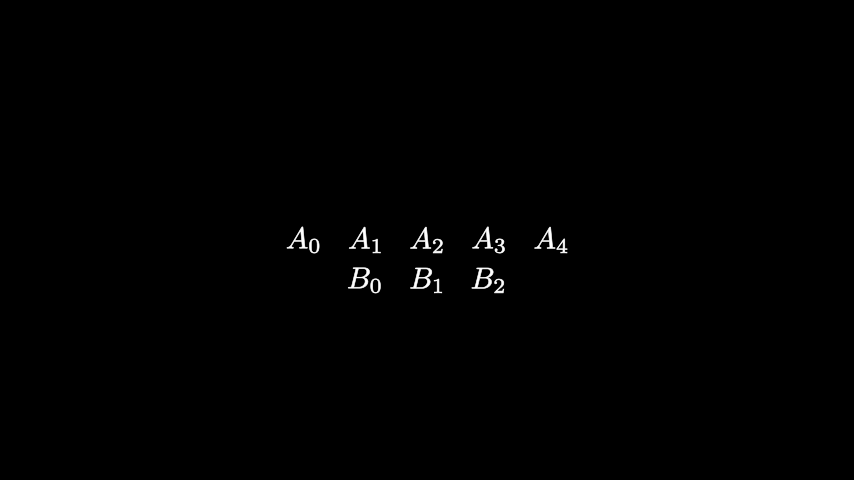
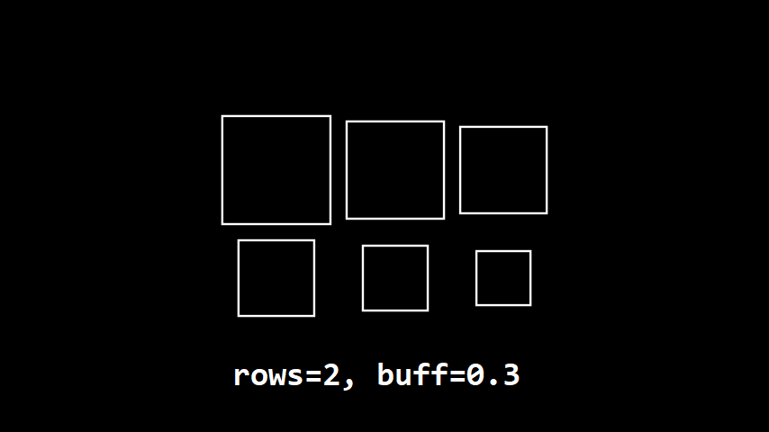
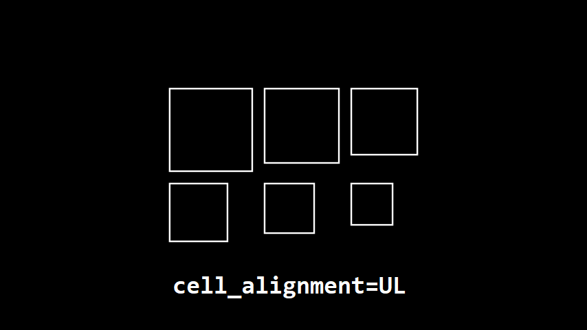
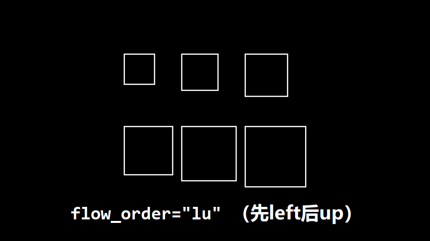

# 四、运动与对齐

以下内容参考了[〔manim教程〕第一讲 物体的位置与坐标变换](https://www.bilibili.com/video/BV1p54y197cC)和[mobject 数学对象](https://github.com/manim-kindergarten/manim_sandbox/wiki/mobject-%E6%95%B0%E5%AD%A6%E5%AF%B9%E8%B1%A1)。


- [四、运动与对齐](#四运动与对齐)
  - [4.1 移动](#41-移动)
      - [shift 移动](#shift-移动)
      - [move\_to 移动至](#move_to-移动至)
  - [4.2 旋转](#42-旋转)
      - [rotate 旋转](#rotate-旋转)
      - [rotate\_about\_origin 绕原点旋转](#rotate_about_origin-绕原点旋转)
      - [rotate\_sheen\_direction 旋转渐变的方向](#rotate_sheen_direction-旋转渐变的方向)
  - [4.3 翻转](#43-翻转)
      - [flip 翻转](#flip-翻转)
  - [4.4 缩放](#44-缩放)
      - [scale 等比缩放](#scale-等比缩放)
      - [stretch 伸缩（非等比缩放）](#stretch-伸缩非等比缩放)
  - [4.5 对齐](#45-对齐)
      - [to\_edge 对齐到边缘 \& to\_corner 对齐到角落](#to_edge-对齐到边缘--to_corner-对齐到角落)
      - [align\_to 对齐到](#align_to-对齐到)
      - [next\_to 在...的旁边](#next_to-在的旁边)
  - [4.6 排列](#46-排列)
      - [arrange 排列](#arrange-排列)
      - [arrange\_in\_grid 网格状排列](#arrange_in_grid-网格状排列)


## 4.1 移动
我们使用三维ndarray来表示一个坐标或向量。在2D场景中，最后一个维度通常设为0。
```Python
import numpy as np
np.array([x, y, 0])  # 这样来表示一个坐标或向量
```

默认情况下，画面宽高比是 $16:9$ ，画面的中心是原点，y轴的范围是 $[-4, 4]$ ，那么x轴的范围是 $[-7.111..., 7.111...]$ 。



倘若渲染时使用 flag `-r W,H` 改变视频（或图片）尺寸，那么x轴的范围不变，y轴的范围相应增大或缩小。

#### shift 移动
`shift(*vector)`

按照给定的向量进行移动。比如说，`mob.shift(np.array([0, 2, 0]))`就是让mob向上移动2个单位。若参数传入多个向量，则先对向量求和后再移动。

#### move_to 移动至
`move_to(point_or_mobject, aligned_edge=ORIGIN, coor_mask=np.array([1, 1, 1])`

移动到指定坐标（或指定对象的坐标）。参数`aligned_edge`指定对齐方式（默认中心对齐）。参数`coor_mask`设置坐标蒙版，比如说，`coor_mask=np.array([1, 0, 1])`可屏蔽y轴方向上的运动。

以下是一些关于运动的常用的常量。
```Python
ORIGIN = np.array((0.0, 0.0, 0.0))

UP = np.array((0.0, 1.0, 0.0))
DOWN = np.array((0.0, -1.0, 0.0))
RIGHT = np.array((1.0, 0.0, 0.0))
LEFT = np.array((-1.0, 0.0, 0.0))
IN: = np.array((0.0, 0.0, -1.0))
OUT: = np.array((0.0, 0.0, 1.0))

X_AXIS = np.array((1.0, 0.0, 0.0))
Y_AXIS = np.array((0.0, 1.0, 0.0))
Z_AXIS = np.array((0.0, 0.0, 1.0))

UL = UP + LEFT
UR = UP + RIGHT
DL = DOWN + LEFT
DR = DOWN + RIGHT
```


## 4.2 旋转
manim默认使用弧度制，默认逆时针方向旋转。如果要旋转一周，那么旋转角度可设置为`PI*2`，表示 $2\pi$ ，或设置为`360*DEGREES`，表示 $360^\circ$ 。（使用角度制时不要忘记乘上`DEGREES`）
```Python
PI = np.pi
TAU = 2 * PI
DEGREES = TAU / 360
```

#### rotate 旋转
`rotate(angle, axis=OUT, *, about_point=None, about_edge=None)`

参数`axis`指定绕什么轴转动（默认`OUT`即绕z正半轴转动），方向符合右手定则。



上一个参数决定了旋转方向，这一个参数`about_point`决定绕什么点（坐标）旋转。参数`about_edge`决定绕背景矩形的哪条边的中点旋转（若传入`UL, UR, DL, DR`则取顶点）。

#### rotate_about_origin 绕原点旋转
`rotate_about_origin(angle, axis=OUT)`

#### rotate_sheen_direction 旋转渐变的方向
`rotate_sheen_direction(angle, axis=OUT, family=True)`

联动[前一章节](3.appearance_of_figure.md)。虽然不算图形的运动，但还是列进来了。


## 4.3 翻转
#### flip 翻转
`flip(axis=UP, *, about_point=None, about_edge=None)`

`axis`决定对称轴指向，后面2个参数指定对称轴过哪个点。本质上就是[rotate](#rotate-旋转)了180度。


## 4.4 缩放
#### scale 等比缩放
`scale(scale_factor: float, scale_stroke=False, *, about_point=None, about_edge=None)`

参数分别为：缩放倍数，是否缩放线条，关于某点缩放（位似），关于自身某条边缩放。

关于等比缩放，常用的方法还有`scale_to_fit_width`，`scale_to_fit_height`，`scale_to_fit_depth`。

#### stretch 伸缩（非等比缩放）
`stretch(factor, dim, *, about_point=None, about_edge=None)`

参数`dim`表示伸缩的方向（维度），`dim=0`是沿x轴伸缩，`dim=1`是沿y轴伸缩，`dim=2`是沿z轴伸缩。

关于非等比缩放，常用的方法还有`stretch_about_point`，`stretch_to_fit_width`，`stretch_to_fit_height`，`stretch_to_fit_depth`。


## 4.5 对齐
#### to_edge 对齐到边缘 & to_corner 对齐到角落
这俩本质上功能完全相同。要传入2个参数：要对齐的边缘或角落，和`buff=0.5`。比如说，`mobj.to_corner(UR, buff=0)`就是把mobj按照缓冲为0的方式对齐到右上角。

#### align_to 对齐到
`align_to(mobject_or_point, direction=ORIGIN)`

参数`mobject_or_point`传入的是要对齐到的对象或坐标。参数`direction`指定的是要对齐到的方向（共8个方向，包括4个边缘对齐，4个顶点对齐），默认不对齐。

#### next_to 在...的旁边
这个方法的参数有点多。
- 某对象或某坐标：`mobject_or_point`
- 对象或坐标的哪个方位：`direction = RIGHT`
- 缓冲：`buff = 0.25`
- 要对齐到的边缘：`aligned_edge = ORIGIN`  默认不对齐，建议`aligned_edge`与`direction`相垂直。
- [坐标蒙版](#move_to-移动至)：`coor_mask = array([1, 1, 1])`

倘若涉及到Group（群组）与Group的对齐，那么下面2个参数就是为子对象（submobject）准备的。
- 用自己的某个子对象去对齐：`submobject_to_align = None`
- 对齐到对方的指定索引的子对象：`index_of_submobject_to_align = None`

举个例子，已知群组`A`和`B`，若想要`B`在`A`的下方，`B[1]`与`A[2]`在左侧对齐，那么有以下2种功能相同的写法。
```Python
B.next_to(A[2], DOWN, aligned_edge=LEFT, 
          submobject_to_align=B[1])
```
```Python
B.next_to(A, DOWN, aligned_edge=LEFT, 
          submobject_to_align=B[1], 
          index_of_submobject_to_align=2)
```


## 4.6 排列
来把Group的子对象排列得整整齐齐。
#### arrange 排列
`arrange(direction=RIGHT, buff=0.25, center=True)`

按指定方向排成一排。`center=True`指默认回到屏幕正中央。

#### arrange_in_grid 网格状排列
- 几行：`rows`
- 几列：`cols`
- 缓冲：`buff` 要指定水平和垂直方向上不同的缓冲，可设为二元组 (row, col)



- 网格中对齐方式：`cell_alignment` *(Vector3DLike)*
- 垂直对齐方式：`row_alignments` 可选填 `u`，`c`，`d`
- 水平对齐方式：`col_alignments` 可选填 `l`，`c`，`r`



- 行高列表：`row_heights` 从上到下匹配，若行高为None，则该行自动调整
- 列宽列表：`col_widths` 从左到右匹配，若列宽为None，则该列自动调整
- 填充网格的顺序：`flow_order`
- - 可填入这些：`"rd"`, `"dr"`, `"ld"`, `"dl"`, `"ru"`, `"ur"`, `"lu"`, `"ul"`

